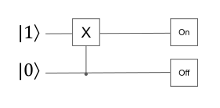

# Quantum Circuit Tool

10/23/2024: A command line tool that allows you to define a quantum circuit and observe the outcome. 

## Flag Commands

All commands are sequential. For example:

The flag order to simualte this circuit would be:

| Flag | Description     | Options                   | Example |
|------|-----------------|---------------------------|---------|
| -q   | Creates a new qubit, and describes the qubit state.   Currently, user can pick from four pure states.     | 0 = l0⟩   1 = l1⟩   2 = l+⟩   3 = l−⟩ | -q 1 |
